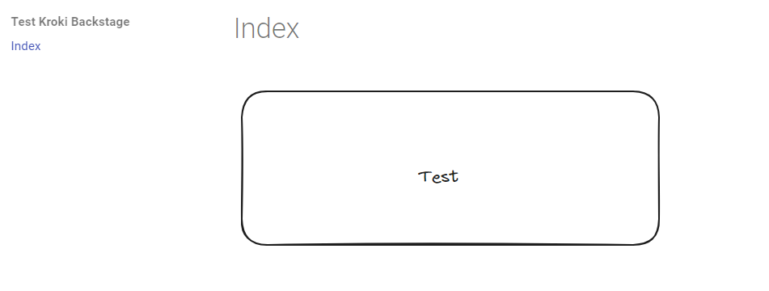
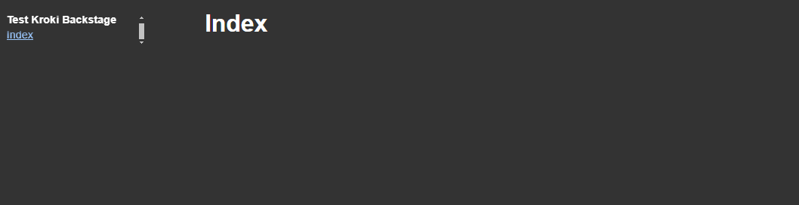
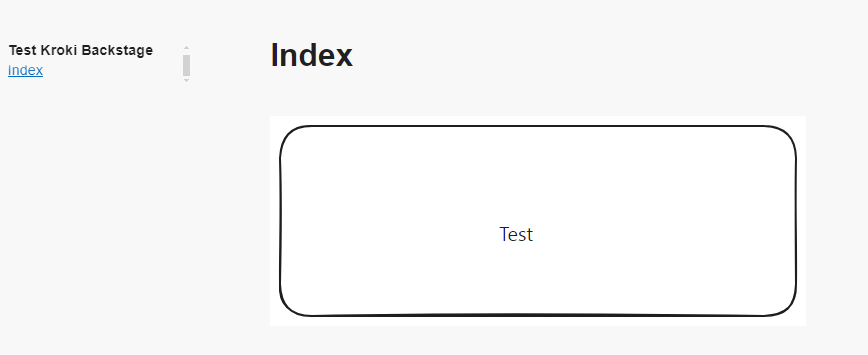

# Mkdocs Kroki Backstage

```
pip3 install mkdocs-techdocs-core mkdocs-kroki-plugin==0.8.1
```


```
mkdocs serve --verbose
```



```
npm install -g @techdocs/cli
techdocs-cli serve --no-docker --verbose
```




If install 0.8.0 it works (except the fonts that are fixed on 0.8.1)

```
pip3 install mkdocs-techdocs-core mkdocs-kroki-plugin==0.8.0
```



