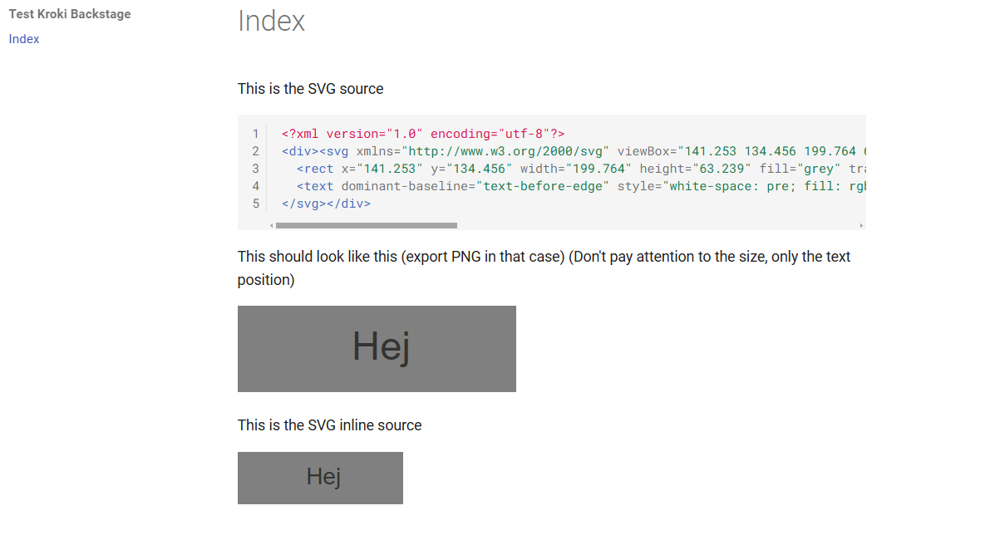
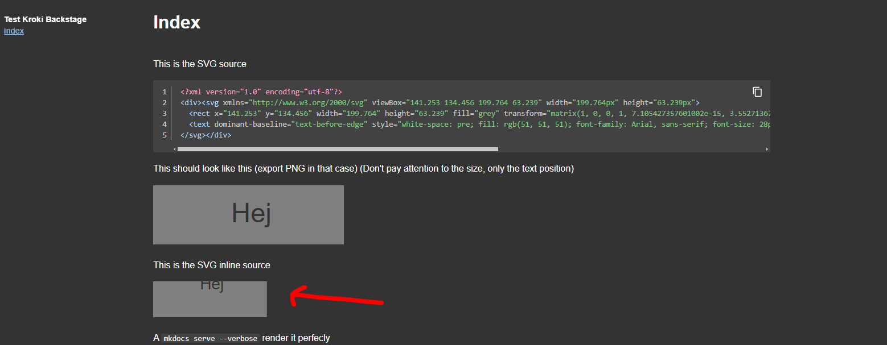
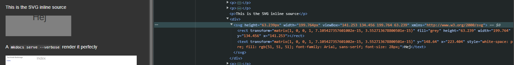
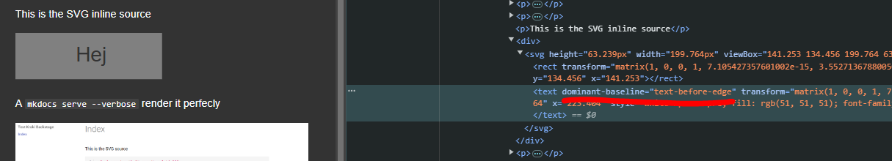

This is the SVG source

```xml
<?xml version="1.0" encoding="utf-8"?>
<svg xmlns="http://www.w3.org/2000/svg" viewBox="141.253 134.456 199.764 63.239" width="199.764px" height="63.239px">
  <rect x="141.253" y="134.456" width="199.764" height="63.239" fill="grey" transform="matrix(1, 0, 0, 1, 7.105427357601002e-15, 3.552713678800501e-15)"/>
  <text dominant-baseline="text-before-edge" style="white-space: pre; fill: rgb(51, 51, 51); font-family: Arial, sans-serif; font-size: 28px;" x="223.404" y="148.64" transform="matrix(1, 0, 0, 1, 7.105427357601002e-15, 3.552713678800501e-15)">Hej</text>
</svg>
```

This should look like this (export PNG in that case) (Don't pay attention to the size, only the text position)


This is the SVG inline source

<?xml version="1.0" encoding="utf-8"?>
<svg xmlns="http://www.w3.org/2000/svg" viewBox="141.253 134.456 199.764 63.239" width="199.764px" height="63.239px">
  <rect x="141.253" y="134.456" width="199.764" height="63.239" fill="grey" transform="matrix(1, 0, 0, 1, 7.105427357601002e-15, 3.552713678800501e-15)"/>
  <text dominant-baseline="text-before-edge" style="white-space: pre; fill: rgb(51, 51, 51); font-family: Arial, sans-serif; font-size: 28px;" x="223.404" y="148.64" transform="matrix(1, 0, 0, 1, 7.105427357601002e-15, 3.552713678800501e-15)">Hej</text>
</svg>

A ` mkdocs serve --verbose` render it perfecly



But rendering it with backstage (dev or prod deployment) the text is misaligned

`techdocs-cli serve --no-docker --verbose`



If we look at the HTML source, the only difference is that the attribute `dominant-baseline` is missing on the `<text>` tag



If we manually add the attribute by editing the HTML source, the text is correctly aligned

	

Why/How the attribute is removed when rendering with backstage? Is there any optimization that remove it?
